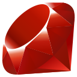
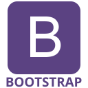

### Hello World... 🌍

My name is Stephan Randle. I am a Software Developer

<!-- Contact Me -->

    <h3>⇒ Contact Me</h3>
    
    
    

<!-- Languages -->

    <h3>⇒ Languages </h3>
    
    
    
    
    
    
    

<!-- Frameworks -->

    <h3>⇒ Frameworks / Libraries / Technologies</h3>
    
    
    
    
    
    
    
    
    
    
    
    
    
    
    
    

<!--
**stephansama/stephansama** is a ✨ _special_ ✨ repository because its `README.md` (this file) appears on your GitHub profile.

Here are some ideas to get you started:

- 🔭 I’m currently working on ...
- 🌱 I’m currently learning ...
- 👯 I’m looking to collaborate on ...
- 🤔 I’m looking for help with ...
- 💬 Ask me about ...
- 📫 How to reach me: ...
- 😄 Pronouns: ...
- ⚡ Fun fact: ...
-->
